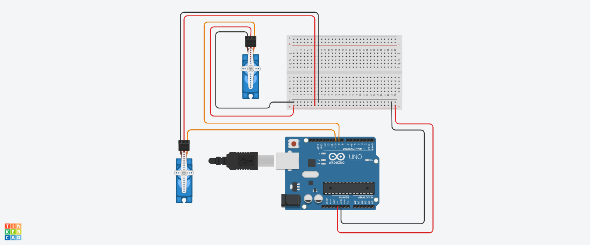

This project contains the code to control the servo motors according the angle input given.
The monitor continuously outputs the Power generated.
It also waits for the user input of angles, which when received, the motors face the solar panel to the given angles.

